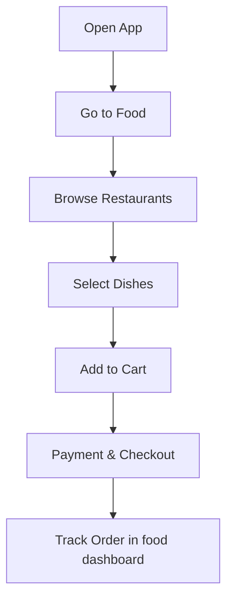
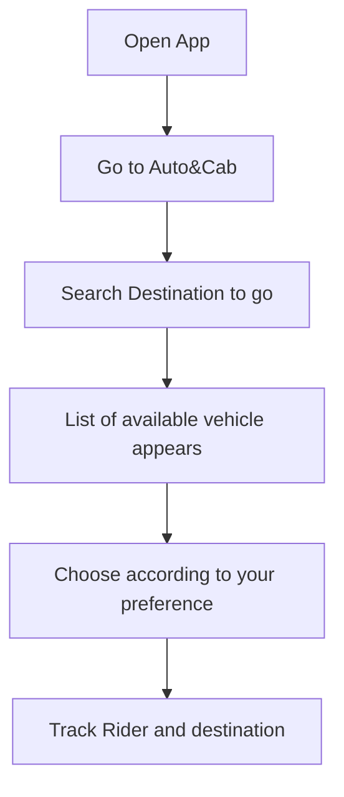
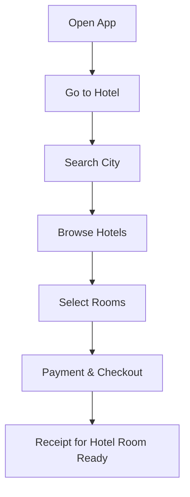
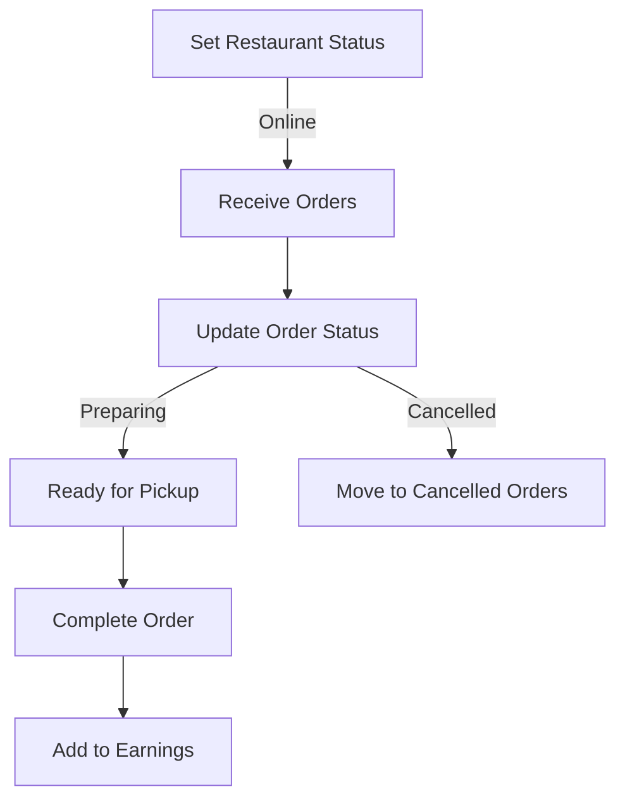

# 🌟 Welcome to Tiofy Ecosystem Documentation

**Tiofy** is a one-stop platform for all your needs, offering:  
- 🍔 **Food Delivery**  
- 🚖 **Cab Booking**  
- 🏨 **Hotel Reservations**
  
*Because why juggle apps when you can have it all in one? Your cravings, rides, and stays—sorted!*

This documentation provides a detailed overview of the Tiofy ecosystem, covering its Android applications and website. Navigate through each section using the links below:

---

## 📚 Table of Contents
1. [What is Tiofy?](#-what-is-tiofy)
2. [Tiofy User Application](#-tiofy-user-application)
   - [Splash Screen](#-splash-screen)
   - [Home Screen](#-home-screen)
     - [Categories Overview](#-categories-overview)
     - [Discounts and Offers](#-discounts-and-offers)
   - [Order History](#-order-history)
   - [Cart](#-cart)
   - [Account](#-account)
     - [Profile](#-profile)
     - [Help & Support](#-help--support)
     - [Logout](#-logout)
   - [Food Ordering Workflow](#-food-ordering-workflow)
   - [Cab Booking Workflow](#-cab-booking-workflow)
   - [Hotel Booking Workflow](#-hotel-booking-workflow)
3. [Tiofy Restaurant Application](#-tiofy-restaurant-application)
     - [Bottom Navbar Overview](#-bottom-navbar-overview)
     - [Home Screen](#-home-screen)
       - [Online/Offline Toggle](#-onlineoffline-toggle)
       - [Order History](#-order-history)
       - [Cancelled Orders](#-cancelled-orders)
     - [Earnings Screen](#-earnings-screen)
       - [Daily Earnings](#-daily-earnings)
       - [Weekly Earnings](#-weekly-earnings)
     - [Notifications Screen](#-notifications-screen)
     - [Account Screen](#-account-screen)
       - [Profile](#-profile)
       - [Help & Support](#-help--support)
       - [Logout](#-logout)
4. [Tiofy Rider Application](#-tiofy-rider-application)
  - [Bottom Navbar Overview](#-bottom-navbar-overview)
     - [Home Screen](#-home-screen)
       - [Available Orders](#available-orders)
       - [Accepted Orders](#accepted-orders)
     - [Earnings Screen](#-earnings-screen)
       - [Daily Earnings](#daily-earnings)
       - [Weekly Earnings](#weekly-earnings)
     - [Notifications Screen](#-notifications-screen)
     - [Account Screen](#-account-screen)
       - [Profile](#profile)
       - [Help & Support](#help--support)
       - [Logout](#logout)
5. [Hotel Booking Website](#-hotel-booking-website)

---

## 🌐 What is Tiofy?

**Tiofy** is an innovative, multi-service platform designed to make life easier by integrating:  
- A **food delivery service** connecting users to their favorite restaurants.  
- A **ride booking service** offering cabs, bikes, and autos.  
- A **hotel reservation system** for daily and hourly stays.

And that’s just the beginning! 🚀 We’re gearing up to add even more services, like liquor delivery, laundry pickup, and much more, making Tiofy your ultimate go-to app for every need.

Tiofy provides user-friendly interfaces for its customers, restaurants, riders, and hotel managers, making the entire ecosystem seamless and efficient.

---

## 📱 Tiofy User Application

The **Tiofy User App** is your gateway to ordering food, booking rides, and reserving hotel rooms. Below is a detailed breakdown of its interface, features, and workflows.

---

### 🎬 Splash Screen
**The starting point of the Tiofy User App.**  
- Features the Tiofy logo with a sleek animation.
- Transition to the home screen after loading.  


---

### 🏠 Home Screen
The **Home Screen** is the central hub of the app, showcasing:  
1. **Categories:**
   - Food
   - Auto & Cab
   - Hotel
2. **Discounts and Offers:**
   - Special promotions for each category.

**Screenshot:**  


---

### 📜 Order History
Track orders for all three categories:  
- Food Delivery  
- Cab Booking  
- Hotel Reservations  

**Screenshots:** 


---

### 🛒 Cart
Available only for **Food Delivery**, the cart allows users to:  
- View selected items. 
- Proceed to checkout.

**Screenshot:**  


---

### 👤 Account
The **Account** section includes:  
1. **Profile:** View and edit user details.  
2. **Help & Support:** Access FAQs and contact support.  
3. **Logout:** Securely log out of the application.

**Screenshots:**  


---

### 🍔 Food Ordering Workflow

**Video Demo:**  
<a href="https://www.youtube.com/shorts/V4Nt7Q6mllk">
  
</a>
 
*Click above to watch how to order food on Tiofy!*

**Flowchart:**  


**Screenshots:**  


### 🍔 Auto&Cab Booking Workflow

**Video Demo:**  
<a href="https://www.youtube.com/shorts/6fFl1Ff2MeQ">
  
</a> 
*Click above to watch how to book Auto&Cab on Tiofy!*

**Flowchart:**  


**Screenshots:**  


### 🍔 Hotel Booking Workflow

**Video Demo:**  
<a href="https://www.youtube.com/shorts/81HnWRInZA0?si=KFg4LOyDJqg_GiDN">
  
</a> 
*Click above to watch how to book hotel rooms on Tiofy!*

**Flowchart:**  


**Screenshots:**  


## 📱 Tiofy Restaurant Application

The **Tiofy Restaurant Application** is tailored for restaurant owners, enabling them to manage orders, monitor earnings, and oversee restaurant activity effectively.

*Because running a restaurant is tough, but managing it shouldn't be harder than perfecting your secret recipe! 🍲😄*

---

### 🔍 Bottom Navbar Overview

The Tiofy Restaurant app's bottom navbar contains the following options:

1. **Home**  
   The main hub for managing order statuses and tracking order histories.

2. **Earnings**  
   A detailed breakdown of daily and weekly earnings.

3. **Notifications**  
   A centralized place for order updates and announcements.

4. **Account**  
   A section for managing profile details, accessing support, and logging out.

---

### 🏠 Home Screen


The **Home Screen** is the primary interface for restaurant owners. It includes the following features:

#### 🌐 Online/Offline Toggle

- A **toggle switch** allows restaurant owners to set their restaurant's availability status:
  - **Online:** The restaurant is visible to users and can receive orders.
  - **Offline:** The restaurant is hidden, and no new orders can be placed.

#### 📂 Order History

- **Active Orders**: View the list of ongoing orders with real-time updates on their status (e.g., Preparing, Ready for Pickup).  
- **Order Details**: Tapping an order displays specific details such as:
  - Customer name and contact.
  - Order items and quantities.
  - Total bill amount.
 
  

#### ❌ Cancelled Orders

- A separate section lists cancelled orders along with reasons (e.g., user cancellation, unavailability).  
- This helps restaurant owners analyze cancellations and improve operations.


[Back to Top](#📚-table-of-contents)

---

### 💵 Earnings Screen

The **Earnings Screen** provides a financial overview for restaurant owners:

**Screenshots:**


#### 📅 Daily Earnings

- A breakdown of **today’s earnings** with a list of completed orders and their respective amounts.

#### 📈 Weekly Earnings

- A **graphical representation** or **list view** of earnings for the current week.
- Track performance trends and identify peak days.

---

### 🔔 Notifications Screen

The **Notifications Screen** is where restaurant owners can view alerts and updates:

- **New Order Alerts**: Get notified instantly when a new order is placed.
- **Cancellations**: Notifications for cancelled orders.
- **Announcements**: Updates about platform features, maintenance, or promotions.

---

### 🧑‍💼 Account Screen

The **Account Screen** allows restaurant owners to manage their profile and access additional tools:

#### 📝 Profile


- Update restaurant details such as:
  - Name
  - Logo
  - Operating hours

#### 🛠️ Help & Support

- Access FAQs or connect with Tiofy's support team for assistance.

#### 🔒 Logout

- Log out of the application securely.

---

### 📽️ Visual Demo of Tiofy Restaurant App

<a href="https://www.youtube.com/shorts/UnImaVOGaXY">
  
</a> 
*Click above to watch demo of Tiofy Restaurant Application*

---

### 💡 Flowchart of Restaurant Operations



## 🚴 Tiofy Rider Application

The **Tiofy Rider Application** is designed for delivery riders and cab drivers to manage orders, track earnings, and stay updated with notifications.

*Because who needs dating apps when you can swipe right on orders and earn all night? 😉*

---

### 🔍 Bottom Navbar Overview

The Tiofy Rider app's bottom navbar contains the following options:

1. **Home**  
   Manage available and accepted orders. Also for looking peak order zones from top restaurants and high volume cab/bike/toto booking area.

2. **Earnings**  
   View daily and weekly earnings.

3. **Notifications**  
   Stay updated with order alerts and platform announcements.

4. **Account**  
   Manage profile, access support, and log out.

---

### 🏠 Home Screen


The **Home Screen** is the central hub for riders. It includes:

#### 📋 Available Orders

- A **list of new orders** sorted by proximity or time of request.  
- Riders can:
  - View order details (pickup and drop-off locations, distance, and estimated earnings).
  - Accept orders with a single tap.

#### ✔️ Accepted Orders

- Displays the list of active orders the rider has accepted.  
- Includes:
  - Navigation to the pickup and drop-off locations.
  - Real-time status updates (e.g., Picked Up, Delivered).
  - Options to mark orders as **Completed** or **Cancelled**.
 
#### 📋 Peak Order Zones

**Screenshots:**


The Peak Order Zone feature helps riders maximize their earnings by highlighting high-demand areas. Here's how it works:

##### For Food Delivery Riders:

- 📍 Restaurant Hotspots:
    - A list of restaurants experiencing high order volumes.
    - Details include restaurant name, address, and live order count.
    - Riders can plan routes to these hotspots to secure more delivery orders.
 
- 🕒 Dynamic Updates:
    - The list updates in real-time, ensuring riders are always directed to the most profitable locations.
 
- 💰 Boosted Earnings:
    - Orders from peak zones often come with higher delivery fees during busy hours.
 
##### For Cab/Bike/Toto Drivers:

- 📍 High-Demand Booking Areas:
    - Displays a list of locations with high cab or bike booking requests.
    - Includes precise addresses, estimated demand, and surge pricing info (if applicable).
 
- 🚦 Efficient Navigation:
    - Directs drivers to busy zones to reduce idle time and increase trip frequency.
 
- 🕒 Time-Sensitive Data:
    - Shows demand peaks during rush hours, events, or weekends to optimize earnings.

[Back to Top](#📚-table-of-contents)

---

### 💵 Earnings Screen

**Screenshots:**


The **Earnings Screen** provides a detailed financial overview for riders:

#### 📅 Daily Earnings

- A list of completed deliveries for the current day with corresponding earnings.

#### 📈 Weekly Earnings

- A **graphical summary** or **list view** of total earnings for the week.  
- Identify the most profitable days and hours.

---

### 🔔 Notifications Screen

The **Notifications Screen** keeps riders informed about:

- **New Orders**: Instant notifications when a nearby order is available.  
- **Platform Updates**: Announcements regarding new features, policies, or promotions.  
- **Cancellations**: Alerts for cancelled deliveries.

---

### 🧑‍💼 Account Screen

The **Account Screen** allows riders to manage their profile and access tools:

#### 📝 Profile


- Update personal details such as:
  - Name
  - Vehicle type
  - Contact information

#### 🛠️ Help & Support

- Access FAQs or contact Tiofy's support team for assistance.

#### 🔒 Logout

- Log out securely from the application.

---

### 📽️ Visual Demo of Tiofy Rider App

<a href="https://www.youtube.com/shorts/AAWRsFdvWx0">
  
</a> 
*Click above to watch demo of Tiofy Rider Application*

---

### 💡 Flowchart of Rider Operations

```mermaid
graph TD
A[New Order Alert] --> B[Check Order Details]
B -->|Accept Order| C[Navigate to Pickup Location]
B -->|Reject Order| D[Move to Next Order]
C --> E[Pick Up Items]
E --> F[Navigate to Drop-off Location]
F --> G[Complete Order]
G --> H[Add to Earnings]


